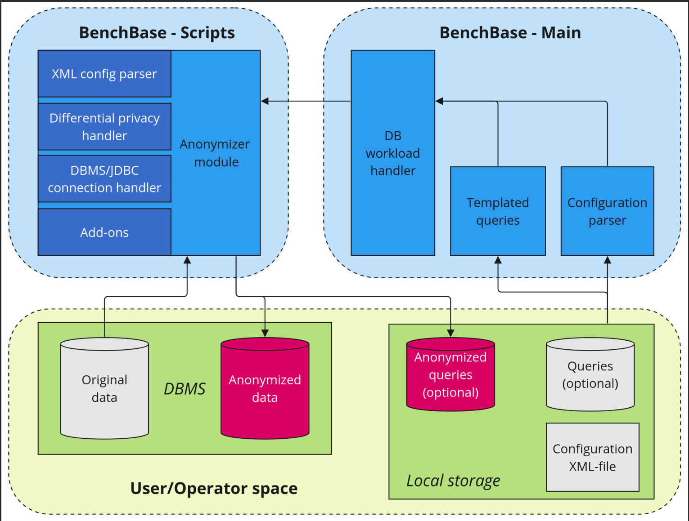

# Anonymization

**NOTE:ANONYMIZATION IS A WORK IN PROGRESS AND DOES CURRENTLY NOT ACTUALLY ANONYMIZE THE DATA. THIS FEATURE WILL BE ADDED LATER**

The anonymization module allows applying privacy mechanisms such as differential privacy or column faking to the data.
The system will pull data from the JDBC connection, anonymize the data and push it back to the DBMS by creating a new table.

## Setup

### Requirements

**Python**: Python 3.10

Requirements can be found inside of the `requirements.txt` file. 

Install with pip:

```bash
pip install -r requirements.txt
```

### Pylint - Linting

Pylint is automatically added by the requirements and can be run as follows:
```bash
pylint --rcfile=.pylintrc src/
```

### Pytest - Testing
Pytest is automatically added by the requirements and can be run as follows:

```bash
pytest ./src/test.py
```


## Configuration files (XML)

### Table selection

Multiple tables can be anonymized sequentially by specifying a `<table>`-tag for each of them and defining the table name.

```xml
<anonymization>
        <table name="t1">
            <!-- config goes here -->
        </table>
        <table name="t2">
            <!-- config goes here -->
        </table>
    </anonymization>
```

### Differential Privacy anonymization

In order to apply differential privacy, a corresponding `<differential_privacy>`-tag must be added to each table.

Differential privacy can be configured with the following parameters:

| Name        | Default | Possible Value                                     | Description                                                                                  |
| ----------- | ------- | -------------------------------------------------- | -------------------------------------------------------------------------------------------- |
| epsilon     | 1.0     | Any value > 0                                      | The privacy budget. Higher values will decrease the privacy guarantee.                       |
| pre_epsilon | 0.5     | Any value between 0 and epsilon (epsilon excluded) | The privacy budget spent on preprocessing of the data. Only necessary for continuous columns. |
| algorithm   | mst     | One of: `mst,aim,dpctgan,patectgan`                | The differential privacy mechanism applied to the data.                                       |

```xml
<anonymization>
    <table name="tablename">
        <differential_privacy
            epsilon="1.5"
            pre_epsilon="0.75"
            algorithm="patectgan">
        </differential_privacy>
    </table>
</anonymization>
```

### Column Information

The columns of a table can be split into four categories:

1. `ignore` - Columns that are ignored by the DP-mechanism. Left untouched.
2. `categorical` - Columns that contain categorical data.
3. `continuous` - Columns of data on a continuous domain. Only numerical columns.
4. `ordinal` - Columns of ordinal meaning. Typically numerical columns with low numers of distinct values.

Each type of column requires its own XML-tag with each member of a type given as a separate tag. (See exampels below for clarification)

If no column type information is given:

-   The anonymization process will automatically try to infer the category best suitable for each column.
-   Automatic anonymization can lead to undesired results or failures in the process.
-   To counter this, each column can be defined by hand with the suitable tags.

---

**Ignore the ID-column and anonymize automatically:**

```xml
<anonymization>
    <table name="item">
        <differential_privacy>
            <ignore>
                <column name="i_id"/>
            </ignore>
            <!-- Other types are inferred automatically -->
        </differential_privacy>
    </table>
</anonymization>
```

The ID-column will be removed from the anonymization process and be added back to the data in its original form before pushing back to the DB! This is useful for primary key columns or columns that contain only NULL values.

---

**Define the type of each column individually:**

```xml
<anonymization>
    <table name="item">
        <differential_privacy>
            <categorical>
                <column name="i_name"/>
                <column name="i_data"/>
                <column name="i_im_id"/>
            </categorical>
            <continuous>
                <column name="i_price"/>
            </continuous>
            <ordinal>
                <column name="i_id"/>
            </ordinal>
        </differential_privacy>
    </table>
</anonymization>
```

<span style="color:red"> **Disclaimer**: As soon as the column types are defined by hand, all columns must be defined. It is not possible to only specify some of the categorical columns and let the algorithms do the rest!</span>

### Continuous Columns

The continuous columns will automatically be preprocessed by the algorithm. The lower and upper bounds of the values are inferred in a differentially private way and therefore use some of the preprocessing epsilon budget. Further, values will be binned in order to be applicable to the DP-mechanism. Automatically, the system uses only 10 bins. In order to achieve better data utility, we suggest to manually fine-tune the settings in the config

In the following example, the number of bins is increased to 1000 and the lower and upper bounds are given by hand such that no preprocessing epsilon must be spent!

```xml
<continuous>
    <column
        name="i_price"
        bins="1000"
        lower="2.0"
        upper="100.0"
    />
</continuous>
```

The parameters must be added inside of the `<column>`-tag. (See below)

| Name  | Default | Possible Value    | Description                                 |
| ----- | ------- | ----------------- | ------------------------------------------- |
| name  | -       | Any string        | The name of the column.                     |
| bins  | 10      | Any value         | The amount of distinct values in the output.|
| lower | -       | Any value         | Lower bound of the values.                  |
| upper | -       | Any value > lower | Upper bound of the values.                  |

---

**A full working example could look like this:**

```xml
<anonymization>
    <table name="item">
        <differential_privacy>
            <categorical>
                <column name="i_name"/>
                <column name="i_data"/>
                <column name="i_im_id"/>
            </categorical>
            <continuous>
                <column
                    name="i_price"
                    bins="100"
                    lower="0"
                    upper="10"
                />
            </continuous>
            <ignore>
                <column name="i_id"/>
            </ignore>
        </differential_privacy>
    </table>
</anonymization>
```

## Value faking anonymization

The anonymization module supports value faking to handle sensitive values. The process is decoupled from differential privacy anonymization, allowing for separate or combined anonymization efforts.

**How to handle sensitive values?**

- A `<value_faking>`-tag must be created to signify that column faking should be applied.
- Column faking can be defined individually on each column with the `<column>`-tag.

The following parameters are available for sensitive values:

| Name    | Default | Possible Value                                   | Description                                                                                    |
| ------- | ------- | ------------------------------------------------ | ---------------------------------------------------------------------------------------------- |
| name    | -       | Any string                                       | The name of the column.                                                                         |
| method  | pystr   | Any method provided by the python faker library  | The faking method of the library. If the method is not found, a random string will be inserted. |
| locales | -       | A string of supported locales, separated by comma | The locale to produce localized values like chinese street names or english first names.        |
| seed    | 0       | Any integer value                                | The privacy budget spent on preprocessing of the data. Only necessary for continuous columns.   |

### Faker categories

Possible methods for faking can be found on the official [Faker documentation](https://faker.readthedocs.io/en/master/)

### Faking example

```xml
<anonymization>
    <table name="item">
        <value_faking>
            <column
                name="i_name"
                method="name"
                locales="en_US"
                seed="0">
            </column>
            <column name="i_data" method="pystr" />
        </value_faking>
    </table>
</anonymization>
```

## Examples

### Basic

The most basic config will need only the name of the table and the privacy mechanism. All necessary information is collected automatically.

```xml
<anonymization>
    <table name="item">
        <differential_privacy />
    </table>
</anonymization>
```

It is possible to specify multiple tables for the anonymization. Each table will be anonymized on its own

```xml
<anonymization>
    <table name="item">
        <differential_privacy />
    </table>
    <table name="item">
        <differential_privacy />
    </table>
</anonymization>
```

The parameters of differential privacy anonymization can be tuned manually

```xml
<anonymization>
    <table name="item">
        <differential_privacy 
            epsilon="1.2" 
            pre_epsilon="0.2" 
            algorithm="aim"
        />
    </table>
</anonymization>
```

### Full config

It is possible to add information about the columns to enable fine-tuning.

```xml
<anonymization>
    <table name="item">
        <differential_privacy>
            <categorical>
                <column name="i_name"/>
                <column name="i_data"/>
                <column name="i_im_id"/>
            </categorical>
            <continuous>
                <column name="i_price"/>
            </continuous>
            <ignore>
                <column name="i_id"/>
            </ignore>
        </differential_privacy>
    </table>
</anonymization>
```

### Sensitive value handling

Sensitive columns can be anonymized further by replcing the values with fake values. A combination of differential privacy and value faking could look as follows:

```xml
<anonymization>
    <table
        name="item">
        <differential_privacy
            epsilon="1.0"
            pre_epsilon="0.0"
            algorithm="aim">
            <ordinal>
                <column name="i_id">
            </ordinal>
            <categorical>
                <column name="i_name"/>
                <column name="i_data"/>
                <column name="i_im_id"/>
            </categorical>
            <continuous>
                <column name="i_price"/>
            </continuous>
        </differential_privacy>
        <value_faking>
            <column
                name="i_name"
                method="name"
                locales="en_US"
                seed="0"
            />
            <column
                name="i_data"
                method="pystr"
                seed="0"
            />
        </value_faking>
    </table>
</anonymization>
```

## Architecture Image



## More Information

[Differential Privacy Fundamentals](https://www.cis.upenn.edu/~aaroth/Papers/privacybook.pdf)

[Smartnoise Library (Algorithm implementations)](https://github.com/opendp/smartnoise-sdk)

[Python Faker documentation](https://faker.readthedocs.io/en/master/)
